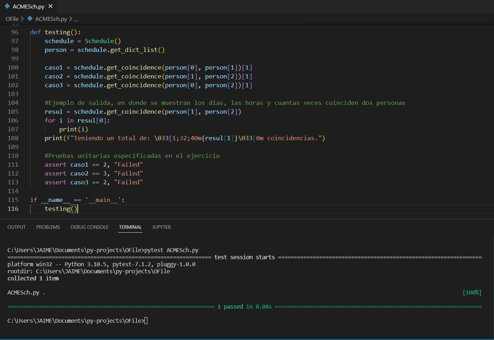
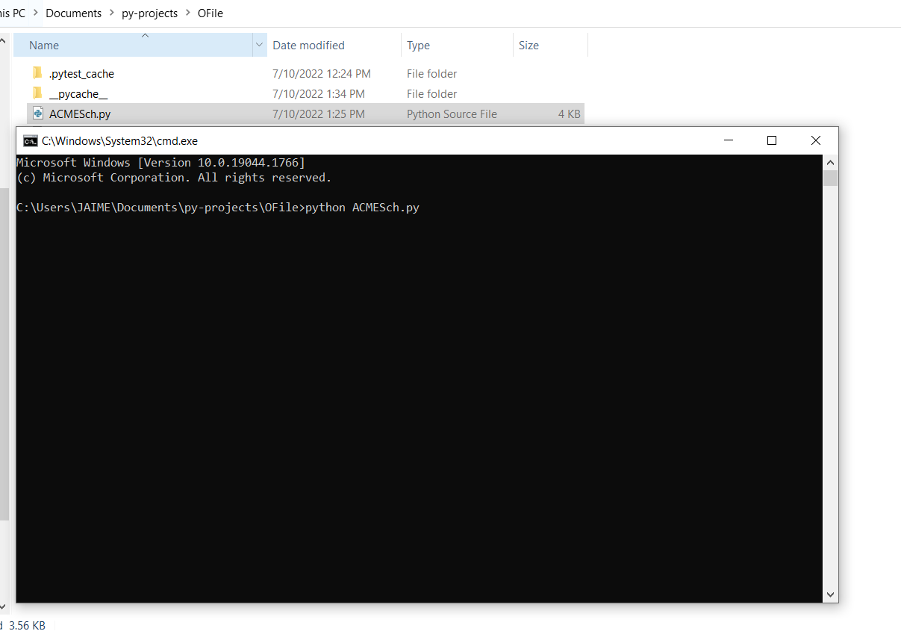
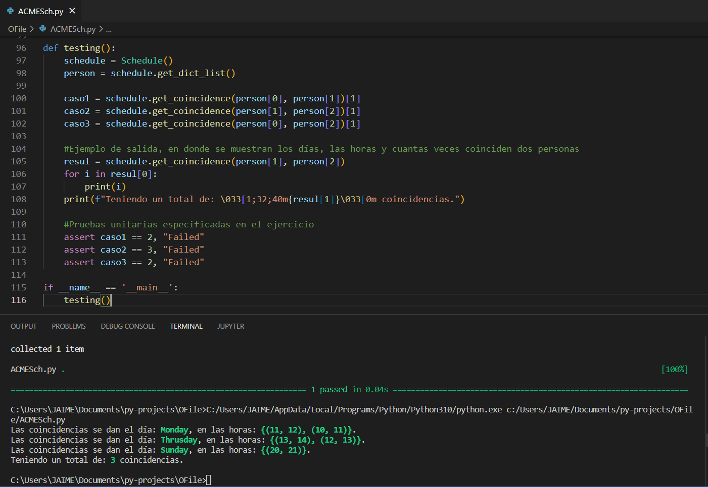
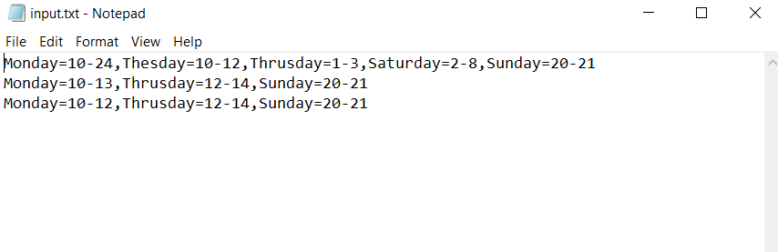
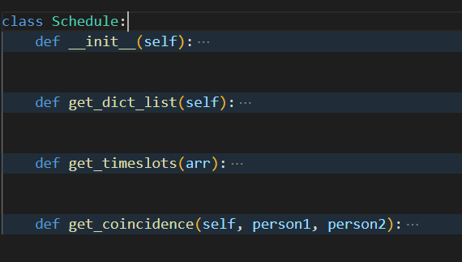
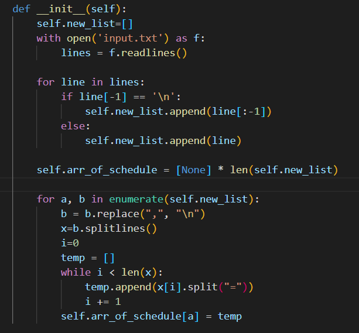
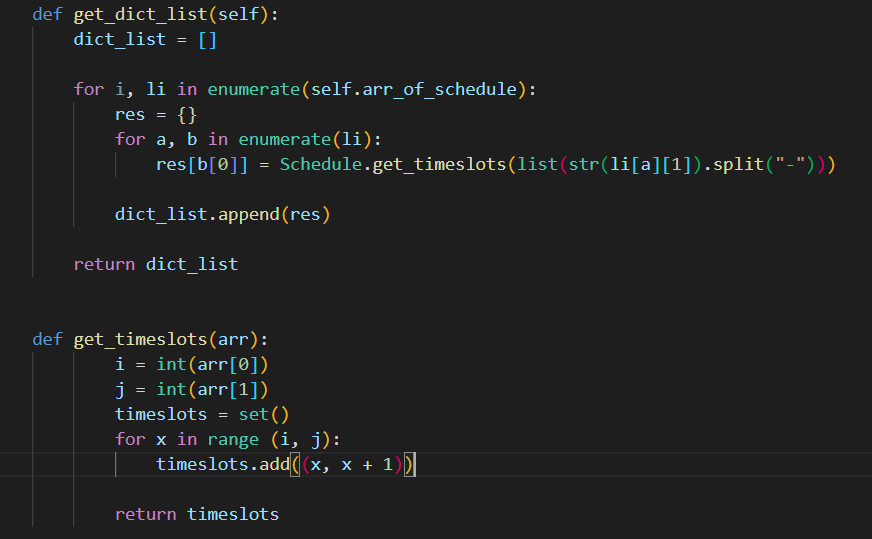
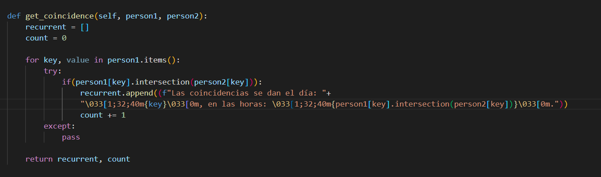
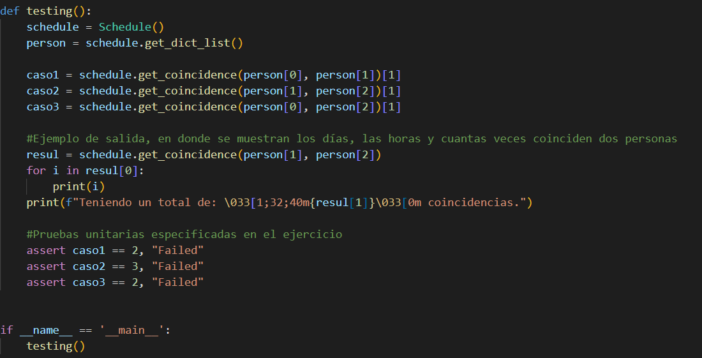

# Ioet Exercise - Schedules

## If you wanna run this app "ACMESch.py" in your machine, you must run this commands:
1. pip install pytest
2. import pytest

## To run the unit tests:
1. pytest ACMESch.py
2. We obtein this:

## To run the script:
1. Open in the cmd the main directory of the script and type python ACMESch.py. Something like this:

2. And we obtein this

## Finally, a brief description about the program:
1. First we have an input with the people's schedule:

2. We are asked to deliver per exit the number of times that two people coincide so, we create a class with all the functions to use:

3. The "__init___" function is used for initialize the array of arrays from the txt:

4. Then we have two functions where the first "get_dict_list" returns a list of dictionaries, 
and the second functions is related to the previews one, and returns all hours within a range:

5. Next,  the "get_coincidence" that receives the value of the two people and returns us both the day, hours and number of times that these people coincide:

6. Finally, the test and the final output:

