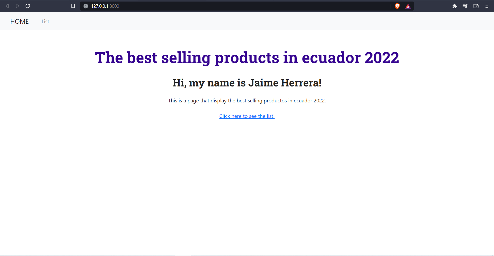
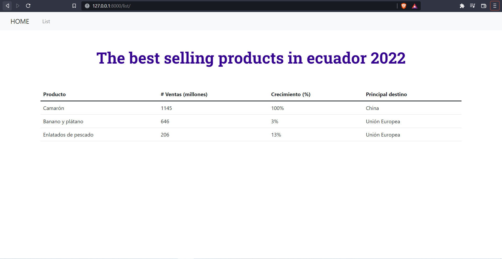

# Codigos
This is a web app in Django, about the best selling products here in Ecuador 2022. 
I am usig some basic futures from Django, like templating language, routs and sqlite for the database.

Here is the final result:

If you wanna run this app "DemoDatoscout" in your machine, you must run this commands:
1. Create a virtual environment
2. Install requirements: pip install -r requirements.txt
3. python manage.py makemigrations
4. python manage.py migrate
